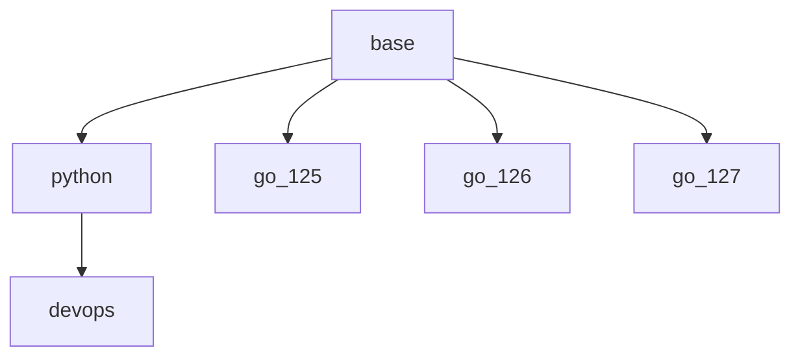

# Architecture

## Build graph

## Shared tools (`base`)

All images inherit these from `dockerfiles/base/Dockerfile`:

- [build-essential](https://packages.debian.org/stable/build-essential), [binutils-gold](https://packages.debian.org/stable/binutils-gold), [git-lfs](https://git-lfs.com/)
- [GitHub CLI](https://cli.github.com/) (`gh`)
- [prek](https://github.com/j178/prek)
- [Taskfile](https://taskfile.dev/) (`task`)
- [Claude Code CLI](https://claude.com/claude-code)
- [CodeRabbit CLI](https://www.coderabbit.ai/cli)
- [Gantry](https://github.com/ivanklee86/gantry)
- [1Password CLI](https://developer.1password.com/docs/cli/) (`op`)
- [bun](https://bun.sh/)
- [ccusage](https://github.com/ryoppippi/ccusage)

## Tools per image

### `python` (`dockerfiles/python/Dockerfile`)
- [uv / uvx](https://docs.astral.sh/uv/)
- [Python](https://www.python.org/) (via `uv python install`)

### `go_125` / `go_126` / `go_127` (`dockerfiles/go/Dockerfile`)
- [Go toolchain](https://go.dev/) (version set via `GO_VERSION` build arg: 1.25, 1.26, or 1.27)
- [golangci-lint](https://golangci-lint.run/)
- [go-junit-report](https://github.com/jstemmer/go-junit-report)
- [gomplate](https://docs.gomplate.ca/)
- [goreleaser](https://goreleaser.com/)

### `devops` (`dockerfiles/devops/Dockerfile`, built on top of `python`)
- [tenv](https://github.com/tofuutils/tenv)
- [go-jsonnet](https://github.com/google/go-jsonnet)
- [AWS CLI](https://aws.amazon.com/cli/)
- [terraform-docs](https://terraform-docs.io/)
- [tflint](https://github.com/terraform-linters/tflint)
- [kubectl](https://kubernetes.io/docs/reference/kubectl/)
- [helm](https://helm.sh/)
- [tanka](https://tanka.dev/) (`tk`, `jb`)
- [k9s](https://k9scli.io/)
